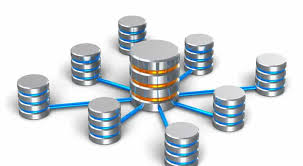

# Base de datos para negocios digitales 
## Topicos
1. INstalacion y cinfiguracion de sisteas de base de datos 
1. matipulacion avanzada  (joins, subconsultas,store  procedure , triggers, index y views)
1. manejo de tranzaciones 
1. base de datos noSQL(MongoDB)

 
 