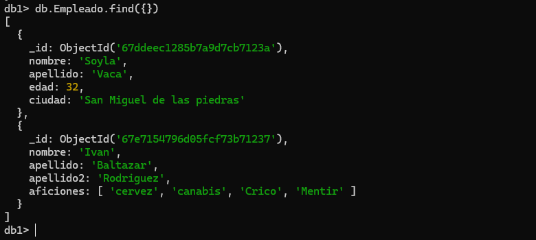
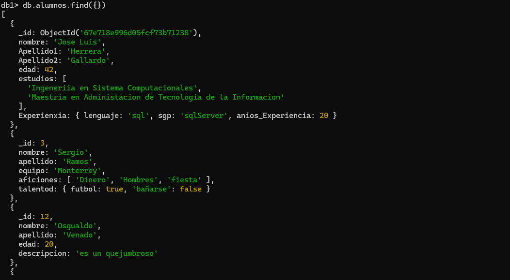

# MongoDB Crud

## Crear una base de datos 

**Solo se crea si contiene por lo menos una coleccion**
```json
use  basededatos
```

## crear una collecion

`use bd1

db.createCollection ('Empleado')`

## Mostarar Coleciones 

`show collections`

## Insercion de un docuemnto
db.Empleado.insertOne (

{
    nombre:'Soyla',
    apellido:'Vaca',
    edad:32,
    ciudad:'San Miguel de las piedras'
}
)

## Insercion de un documento mas complejo con  array 


```json
db.Empleado.insertOne({
  
   nombre:'Ivan',
   apellido:'Baltazar',
   apellido2:'Rodriguez',
   aficiones:['cervez','canabis','Crico','Mentir']
})

```

**Eliminar una coleccion**
```json
db.coleccion.drop()
```
__Ejemplo__
```json
db.empleado.drop()
```
## ejemplo


## Insercion de documentos mas complejos con documentos anidados ,array y ID

```json 
 db.alumnos.insertOne(
 {
   nombre: 'Jose Luis',
   Apellido1: 'Herrera',
   Apellido2: 'Gallardo',
   edad:41,
   estudios:[
    'Ingeneriia en Sistema Computacionales',
    'Maestria en Administacion de Tecnologia de la Informacion'
   ],
   Experienxia:{
     lenguaje:'sql',
     sgp:'sqlServer',
    anios_Experiencia: 20

   }
 }
 
 )

```


```json
db.alumnos.insertOne({

    _id:3,
    nombre:'Sergio',
    apellido:'Ramos',
    equipo:'Monterrey',
    aficiones:['Dinero','Hombres','fiesta'],
    talentod:{
        futbol:true,
        bañarse:false
    }
})
```

## Insertar Multiples Documentos

```json

db.alumnos.insertMany(
[
{
   _id:12,
    nombre:'Osgualdo',
    apellido:'Venado',
    edad:20,
    descripcion: 'es un quejumbroso'
},
{
 nombre:'Maritza',
apellido:'Rechicken',
edad:20,
descripcion: [
'ser vibora','Ilusionar','Caguamear'],
direcion:{
    calle:'Del infierno',
    numero: 666
},
esposos:[
    {
        nombre: 'joshua',
        edad: 20,
        pension :-34,
        hijos:['Ivan','Jose']
    },
    {
        Nombre:'Leo',
        edad: 15,
        pension: 70,
        complaciente: true
    }
]
}
]
)
```

```json
db.alumnos.find({}) //para checar si esta  

```
## ejemplo


## busquedas. condiciones simples de igualdadd Metodo find()

1. Selecionar todos los documentos de la colecion libros 

```json
db.libros.find ({})
```
2. Selecionar todos los documentos que sean de la editorial Biblio

```json
db.libros.find ({editorial: 'Biblio'})

```
3. Mostrar todos los documentos que el precio sea 25
```json
db.libros.find ({precio: 25})
```
4. Seleconar todos los documentos  donde el  titulo sea 'json para todod'
```json
db.libros.find ({titulo: 'JSON para todos'})
```

## Operadores de Comparacion 

[OPERADORES DE COMPARACION](https://www.mongodb.com/docs/manual/reference/operator/query/)


1. MOSTARA TODOS LOS DOCUMENTOS DONDE EL PRECIO SEA MAYOR DE 25

```json

db.libros.find({precio:{$gt:25}})

```

2. Mostrara los documentos donde el precio sea 25

```json

db.libros.find({precio:{$eq:25}})
db.libros.find ({precio: 25})

```
3. Mostrara los documentos cuya cantidad sea menor a 5

```json
db.libros.find({cantidad:{$lt:5}})

```
4. Mostrar los docuemntos que permitan al  editor biblio o Planeta 
```json
db.libros.find(

{
    editorial:{
    $in: ['Planeta', 'Biblio' ] 
    }
}
)
```

5. Mostrar los docuemntos de libros que cueste  20 o 25
```json
db.libros.find(

{
    precio:{
    $in: [20, 25] 
    }
}
)
```
5.Recuperar todos los documentos que no cuenten 20 o 25
```json
db.libros.find(

{
    precio:{
    $nin: [20, 25] 
    }
}
)
```

**Instruccion findOne**

7. Recuperar solo una fila (DEvuelve el primer elemento que cumpla la condicion )
```json
db.libros.findOne(

{
    precio:{
    $in: [20, 25] 
    }
}
)
```

## Operadores logicos 

[Operadores Logicos](https://www.mongodb.com/docs/manual/reference/operator/query-logical/)


### Operadoe AND

- Dos posibles opciones 

1. La simple, mediante condiciones separada por comas 
- -> Con esto ausmo que es una and 
1. usando el operador $and
  { $and: [ { <expression1> }, { <expression2> } , ... , { <expressionN> } ] }
  -db.libros.find({$and:[{condicion1},{condicion2}]}) 

  1. Mostrar todod aquellos libros que cueste mas de 25 cuya cantidad sea mayor a 15 
  ```json
  db.libros.find(
    {
    precio:{$gt:25},
    cantidad:{$lt:15}

  }
  )
  

db.libros.find(
    {
        $and:[
            {precio:{$gt:25}},
            {cantidad:{$lt:15}}
        ]
    }
)
  ```
  ### Operador or (%or)


  - Mostrar todos aquellos que cuesten  mas  de 25 o cuya cantidad sea inferior a 15

  ```json

db.libros.find(
    {
        $or :[
            {
                precio:{$gt:25}
                
                },
                {
                    cantidad:{$lt:15}
                }
        ]
    }
)

  ```

  ### Ejemplo con and y or combinadoas 

db.inventory.find( {
    $and: [
        { $or: [ { qty: { $lt : 10 } }, { qty : { $gt: 50 } } ] },
        { $or: [ { sale: true }, { price : { $lt : 5 } } ] }
    ]
} )

  --mostrar los libros de la editorial Biblio con precio mayor a 30 o libros de la editorial Planeta con precio  mayor a 20

```json
  db.libros.find(
    {
       $and: [
         { $or: [ { editorial:'Biblio' },{precio:{$gt:30}}]},
         { $or: [ { editorial:{$eq:'Planeta'}},{precio:{$gt:20}}]}
    
       ]      
  }
  )
```
### Proyeccion (ver ciertas columnas )

db.collecion.find(filtro,columnas)

1. selecionar todod los libros ,solo mostramdo el titulo 

```json
db.libros.find({},{titulo:1})

db.libros.find({},{titulo:1, _id:0})

```
### sintaxia

```json
db.getCollection('libros').find(
  { editorial: 'Planeta' },
  { _id: 0, titulo: 1, editorial: 1, precio: 1 }
);

```

### Operador exisist (permite saber si un campo se encuentra o no en un docuemnto)
[operador exisist](https://www.mongodb.com/docs/manual/reference/operator/query/exists/)


{ field: { $exists: <boolean> } }

```json

db.libros.find({editorial: {$exists: true }})


db.libos.insertOne(
{
    _id:10,
    titulo: 'Mongo en Negocio Digitales',
    editorial: 'Terra',
    precio:125
})

- Buscar todos los documentos que no tengan cantidad 
db.libros.find(
    {cantidad:{$exists:false}}
)

```
## Operadores Type (Permite solicitar a MongoDB si un campoi correcto a un tipo )

[Operacdore type](https://www.mongodb.com/docs/manual/reference/operator/query/type/)
```json
db.libros.find(
    {
        precio:{$type:16}
    }
)
```
---Mostrar tosos los documentos donde el precio ses de tipo double o entero o cualquier otrp tipo de datos 

```json
db.libros.find(
    {
        precio:{$type:'int'}
    }
)
db.libros.insertMany([
{
_id:12,
titulo:'IA',
editorial:'Terra',
precio:125,
cantidad:20
},
{
_id:13,
titulo:'Python para todos',
editorial:2001,
precio:200,
cantidad:30

}
]
)

-- Selectccionar todos los documentos de libros donde los valores donde los valores de la editorial sea string

db.libros.find(
    {editorial:{$type:2}}
)


db.libros.find(
    {editorial:{$type:'string'}}
)

db.libros.find(
    {editorial:{$type:'int'}}
)


```

# Modificando Documentos 


## Comandos importantes 

1. UpdateOne-modifica un solo documento 
1. UpdateMany->modificar multiples documentos 
1. replaceOne ->Sustituir el contenido completo de un documento 

Tiene  el siguiente formato 

```json
db.collection.updateOne(
{filtro},
{operadores:}
)

```

[Operadores Updare](https://www.mongodb.com/docs/manual/reference/operator/update/)

**Operador $et**
1. Modificar un documento

```json

db.libros.updateOne({titulo:'Python para todod'},{$set:{titulo:'Java para todos'}})


```
--Modificar el documento con _id:10 estaableciendp el precio en 100 y la cantidad en 50

```json
db.libros.updateOne({id:10},{$set:{precio:100,cantidad:50}})
```

--modificar los libros donde el precio sea mayor a 100 cambiarlo poe 150 
db.libros.updateMany(
    {
        precio: { $gt: 100 }
    },
    {
        $set: { precio: 150 }
    }
)

## Operadores $in y $nu1

-- incrementa todos lod precops a 5
```json
db.libros.updateMany(

{editorial:'Terra'},
{
    $inc:{precio:5}
}

)

```

---multiplicar todods los libros donde la cantidada sea mayor a 20 mutiplicar la cantidad por 2
```json
db.libros.updateMany(
    { cantidad: { $gt: 20 } },  
    { $mul: { cantidad: 2 } }   
)


db.libros.find({_id:{$in:[1,7,10,13]}})
````
--actualizar todos los libros miltiplicando por 2 la cantidad y el precio de todos aquellos libros que sea mayor a  20 
```json
db.libros.updateMany(
    { precio: { $gt: 20 } },       
    {
        $mul: {                   
            cantidad: 2,           
            precio: 2    
        }          
    }
)

```
## remplazar documentos (replaceOne)

--Actualizar todo el documento del id 2 por el titulo de la tierra a la luna autor julio verne, editorial terra, precio 100


```json
db.libros.replaceOne(

{_id:2},
{
    tutulo: 'De la Tierra a la Luna ',
    autor:'Julio Verne',
    editorial:'Terra',
    precio:100

}
)

```

## Borrar documentos 

1.  deleteOne ->elimina un solo documento
1. deleteMany ->Eliminar multiples documentos 


--elemininar el documento con el id 2
```json
db.libros.deleteOne(
{_id:2}
)

```

--eliminar todos los libros  donde la cantidad  es mayor a 150

```json

db.libros.deleteMany(
    {
        libros:{$gt:150}
    }
)
    


    db.libros.deleteMany(
    {
  cantidad:{$gt:150}
    }
)
```    
    


## Expreciones Regulares

--seleciona todos los libros que contengan  en el titulo una t minuscula 
```json

db.libros.find({titulo:/t/})
```
--selecionar todos los libros que el titulo contenga la palabra JSON
```json

db.libros.find({titulo:/ JSON /})
```
--SLEECIONA QUE TODOS LOS LIBROS QUE EN EL TITULO CONTENGAN CON TERMINACION TOS 

```json

db.libros.find({titulo:/tos/})
```
--selecionar todos los libros que en el titulo comiencen con J

```json

db.libros.find({titulo:/^J/})   
```


## Operador $regex
[OPERADORES $Regex](https://www.mongodb.com/docs/manual/reference/operator/query/regex/)

--Selecionar los libros  que contenga la palabra "para"
```json
db.libros.find(
    {
        titulo:{
            $regex:'para'
        }
    }
)

db.libros.find(
    {
        titulo:{
            $regex:/para/
        }
    }
)

```
--selecionar tosos los titulos que  contengan la palabra Json

```json
db.libros.find(
    {
        titulo:{
            $regex:'JSON'
        }
    }
)

db.libros.find(
    {
        titulo:{
            $regex:/JSON/
        }
    }
)

```
---

--dsistingir entre Mayusculas y minusculas 
```json


db.libros.find(
    {
        titulo:{
            $regex:/json/i
        }
    }
)

{ <field>: { $regex: /pattern/, $options: '<options>' } }

db.libros.find(
    {
        titulo:{
            $regex:/json/, $options:'i'
        }
    }
)

db.libros.find(
    {
        titulo:{
            $regex:/^j/, $options:'i'
        }
    }
)

```

--selecionar todods los documentos de libro donde los titulos comiensen con 'es' y no distingan entre mayuscula y minusvula 


```json
db.libros.find(
    {
        titulo:{
            $regex:/es$/, $options:'i'
        }
    }
)


```


## Metodos Sort (operador documento)

--ordenar los libros de manarea ascendentes por el precio 
```json

db.libros.find(
{},{
    _id:0,
    titulo:1,
    precio:1

})


db.libros.find(
{},{
    _id:0,
    titulo:1,
    precio:1

}).sort({precio:1})

```

---oedwnar los libros decendentes 
```json
db.libros.find(
{},{
    _id:0,
    titulo:1,
    precio:1

}).sort({precio:-1})
``

ordenar los libros acedente por la editorial  y de maner adecedente por el precio mostrando  el titulo  el precio ybla editorial 
```json

db.libros.find(
{},{
    _id:0,
    precio:1,
    editorial:1

}).sort({editorial:1, precio:-1})

```
## otros metodos dkip,limit,size
```json

db.libros.find(
    {}

).size()


db.libros.find(
    {
        titulo:{
            $regex:/^j/, $options:'i'
        }
    }
).size()


```

--Busccar todos los libros pero mostrar los 2 primeros 


```json

db.libros.find({}).limit(2)

--saltar 
db.libros.find({}).skip(2)

```


## Borrar coleciones y base de datos 

db.libros.drop()


db.dropDatabase()