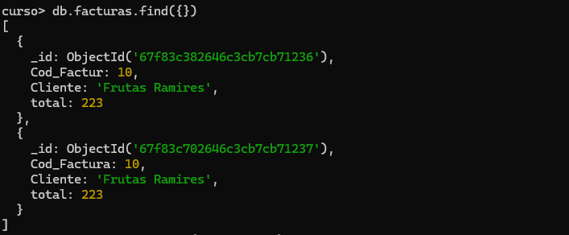
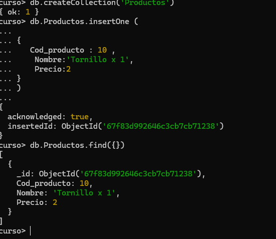
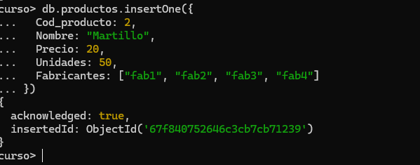
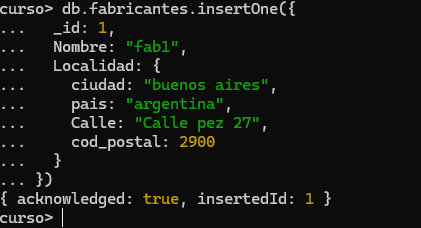
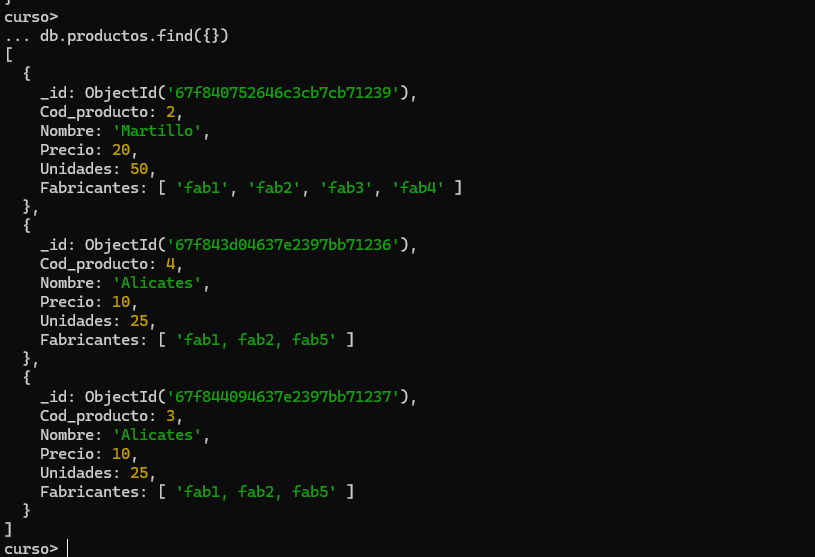

# Practica 1: Base de Datos, colecciones e inserts

1. Conectarnos con mongosh a MongoDB
1. Crear una base de datos llamada curso
```json

use curso
```
1. Comprobar que la base de datos no existe


1. Crear una coleccion que se llame facturas y mostrarla

``` json
 db.createCollection('facturas')
 show collections
```

5. Insertar un documento con los siguientes datos:


| Codigo   | Valor   |
|-------------|-------------|
| Cod_Factura | 10 |
| Cliente | Frutas Ramirez |
| Total | 223 |

| Codigo   | Valor   |
|-------------|-------------|
| Cod_Factura | 20 |
| Cliente | Ferreteria Juan |
| Total | 140 |


## Insercion de un docuemnto

```json
db.facturas.insertOne (

{
    Cod_Factura: 10 ,
    Cliente:'Frutas Ramires',
    total:223
},
{
    Cod_Factura: 20 ,
    Cliente:'Ferreteria Juan',
    total:140
}
)

db.facturas.find({})
```
## ejemplo 



6. Crear una nueva colección pero usando directamente el insertOne.
   insertar un documento en la colección productos con los siguientes datos:

| Codigo   | Valor   |
|-------------|-------------|
| Cod_producto | 1 |
| Nombre | Tornillo x 1" |
| Precio | 2 |

## Insercion de un docuemnto

db.createCollection('productos')

```json
db.productos.insertOne (

{
   Cod_producto : 10 ,
    Nombre:'Tornillo x 1',
    Precio:2
}
)

db.productos.find({})
```
## ejemplo 



7. Crear un nuevo documento de producto que contenga un array. Con los siguientes datos:

| Codigo   | Valor   |
|-------------|-------------|
| Cod_producto | 2 |
| Nombre | Martillo |
| Precio | 20 |
| Unidades | 50 |
| Fabricantes | fab1, fab2, fab3,fab4 |

```json
db.productos.insertOne({
  Cod_producto: 2,
  Nombre: "Martillo",
  Precio: 20,
  Unidades: 50,
  Fabricantes: ["fab1", "fab2", "fab3", "fab4"]
})
```




8. Borrar la colección Facturas y comprobar que se borro

db.Facturas.drop()


9. Insertar un documento en una colección denominada **fabricantes**
   para probar los subdocumentos y la clave _id personalizada

| Codigo   | Valor   |
|-------------|-------------|
| id | 1 |
| Nombre | fab1 |
| Localidad | ciudad: buenos aires, pais: argentina, Calle: Calle pez 27,cod_postal:2900 |

```json
db.fabricantes.insertOne({
  _id: 1,
  Nombre: "fab1",
  Localidad: {
    ciudad: "buenos aires",
    pais: "argentina",
    Calle: "Calle pez 27",
    cod_postal: 2900
  }
})

```




10. Realizar una inserción de varios documentos en a colección
    productos

| Codigo   | Valor   |
|-------------|-------------|
| Cod_producto | 3 |
| Nombre | Alicates |
| Precio | 10 |
| Unidades | 25 |
| Fabricantes | fab1, fab2, fab5 |

| Codigo   | Valor   |
|-------------|-------------|
| Cod_producto | 4 |
| Nombre | Arandela |
| Precio | 1 |
| Unidades | 500 |
| Fabricantes | fab2, fab3, fab4 |
```json

db.productos.insertOne({
  Cod_producto: 3,
  Nombre: "Alicates",
  Precio: 10,
  Unidades: 25,
  Fabricantes: ["fab1, fab2, fab5"]
},{
    od_producto: 4,
  Nombre: "Arandela ",
  Precio: 1,
  Unidades: 500,
  Fabricantes: ["fab2, fab3, fab4"]

}

)

```
