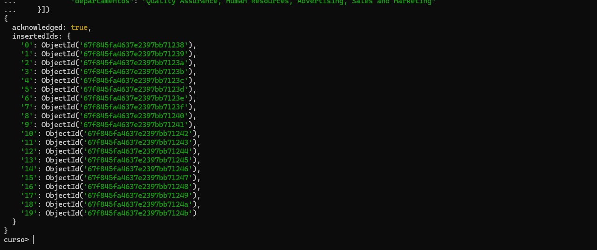
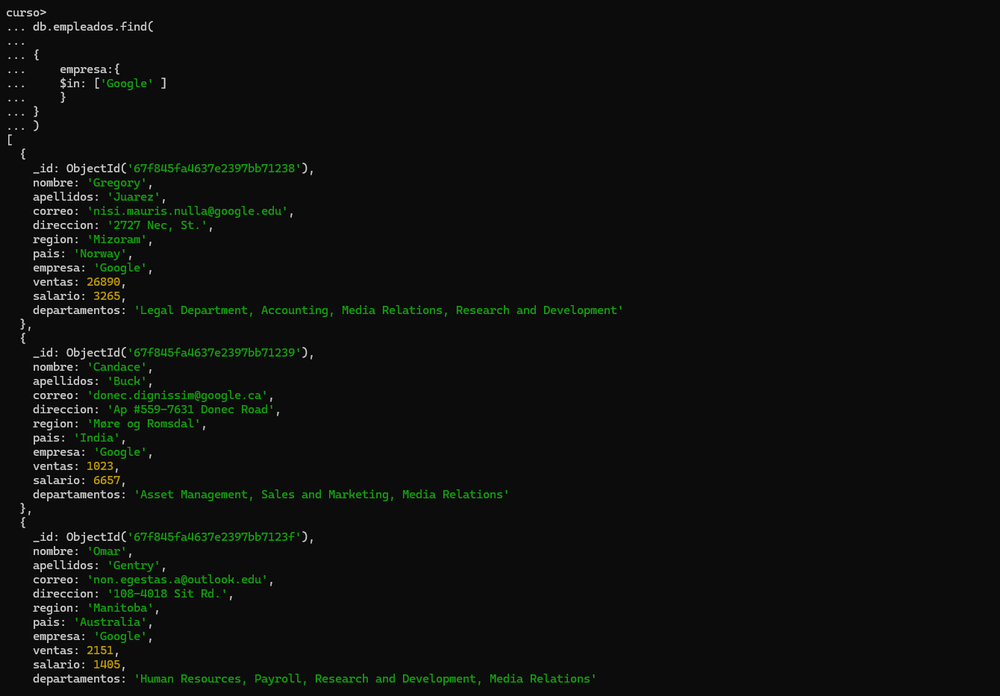
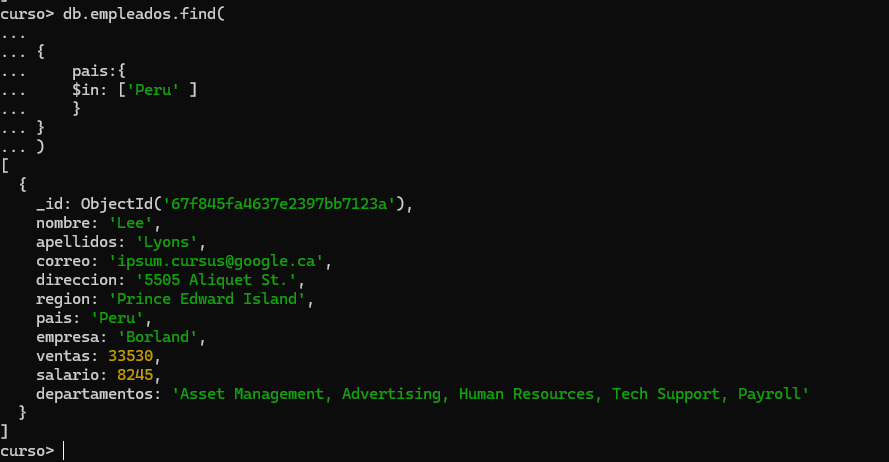
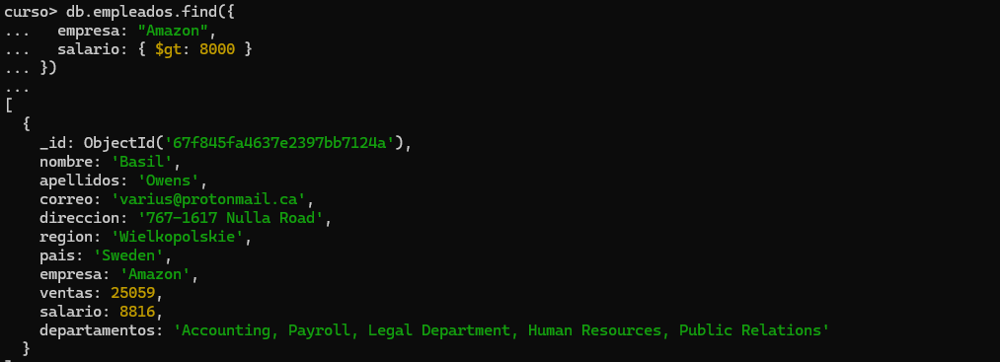
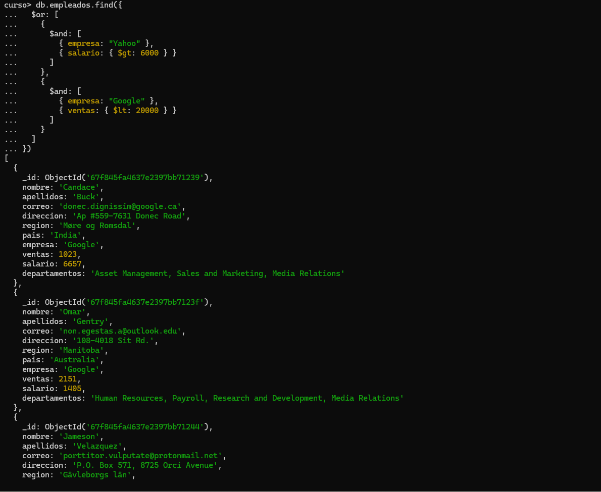
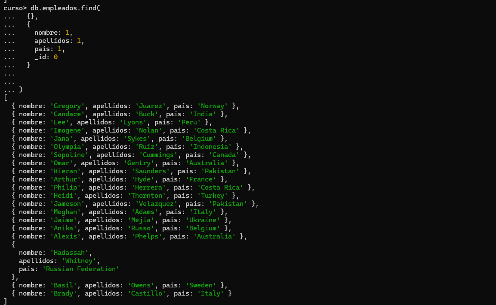

# Consultas

1. Cargar el archivo empleados.json

2. Utilizar la base de datos curso

3. Buscar todos los empleados que trabajen en google

```json
db.empleados.find(

{
    empresa:{
    $in: ['Google' ] 
    }
}
)

db.empleados.find({})


6 trabajan en Google
```



4. Empleados que vivan en peru

```json
db.empleados.find(

{
    pais:{
    $in: ['Peru' ] 
    }
}
)
```



5. Empleados que ganen mas de 8000 dolares
```json
db.empleados.find(

{
     salario:{$gt:8000}
     
}
)
 son 5 empleados 
```


6. Empleados con ventas inferiores a 10000
```json
db.empleados.find({
  ventas : { $lt: 10000 }
})

 son 6
```


7. Realizar la consulta anterior pero devolviendo una sola fila
```json
db.empleados.findOne({
  ventas: { $lt: 10000 }
})
```


8. Empleados que trabajan en google o en yahoo con el operador $in
```json
db.empleados.find(

{
    empresa:{
    $in: ['Google','Yahoo' ] 
    }, 
}
)

```


9. Empleados de amazon que ganen mas de 8000 dolares

```json
db.empleados.find({
  empresa: "Amazon",
  salario: { $gt: 8000 }
})

```


10. Empleados que trabajan en Google o en Yahoo con el operador $or
```json

db.empleados.find({
  $or: [
    { empresa: "Google" },
    { empresa: "Yahoo" }
  ]
})
son 7
```


11. Empleados que trabajen en Yahoo que ganen mas de 6000 o empleados que trabajen en Google que tengan ventas inferiores a 20000

```json
db.empleados.find({
  $or: [
    {
      $and: [
        { empresa: "Yahoo" },
        { salario: { $gt: 6000 } }
      ]
    },
    {
      $and: [
        { empresa: "Google" },
        { ventas: { $lt: 20000 } }
      ]
    }
  ]
})
 4 empleados
```


12. Visualizar el nombre, apellidos y el país de cada empleado
```json
db.empleados.find(
  {},
  {
    nombre: 1,
    apellidos: 1,
    pais: 1,
    _id: 0
  }
)

```
