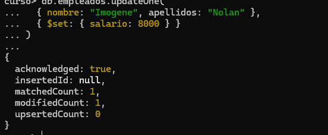
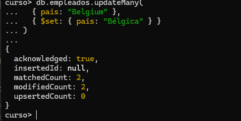
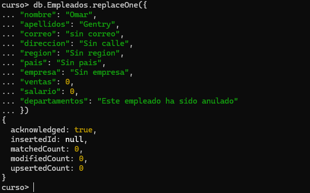
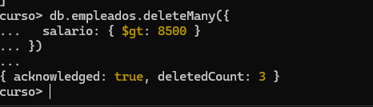
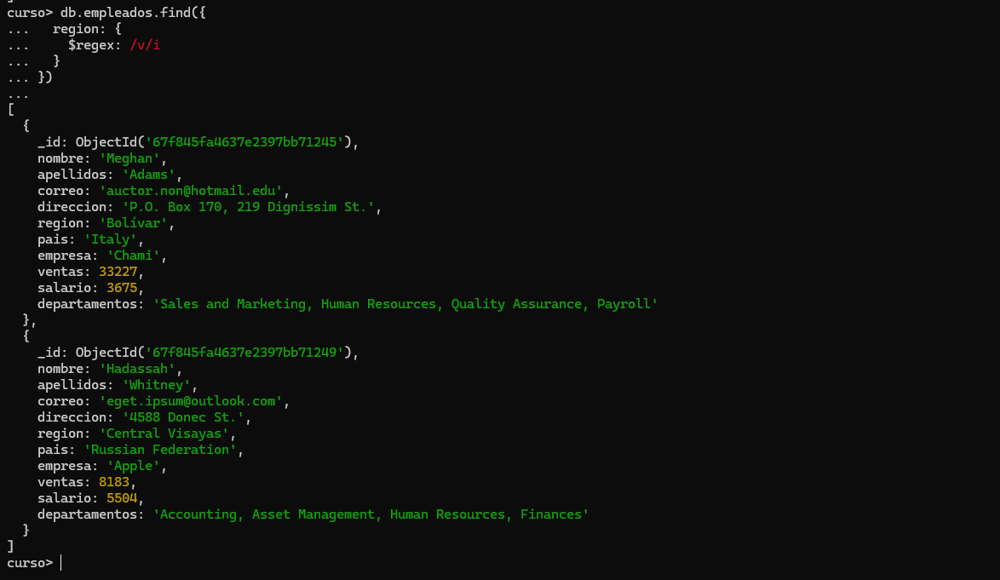
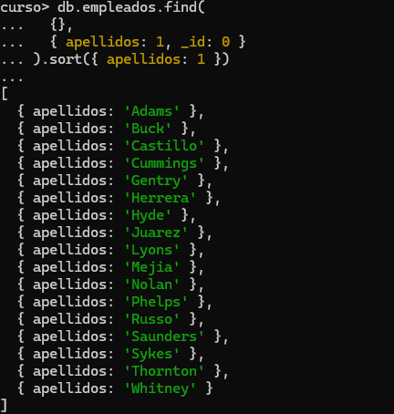
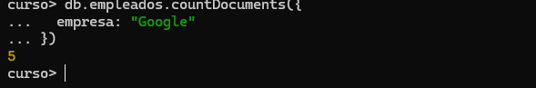
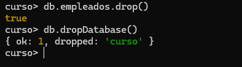

# Practica 3. Updates y Deletes

1. Cambiar el salario del empleado Imogene Nolan. Se le asigna 8000.

```json

db.empleados.updateOne(
  { nombre: "Imogene", apellidos: "Nolan" },
  { $set: { salario: 8000 } }
)

```


2. Cambiar "Belgium" por "Bélgica" en los empleados (debe haber dos).

```json
db.empleados.updateMany(
  { pais: "Belgium" },
  { $set: { pais: "Bélgica" } }
)

```


4. Reemplazar el empleado Omar Gentry por el siguiente documento:

```json
db.Empleados.replaceOne({
"nombre": "Omar",
"apellidos": "Gentry",
"correo": "sin correo",
"direccion": "Sin calle",
"region": "Sin region",
"pais": "Sin pais",
"empresa": "Sin empresa",
"ventas": 0,
"salario": 0,
"departamentos": "Este empleado ha sido anulado"
})
```



5. Con un find comprobar que el empleado ha sido modificado

```json
db.empleados.find({
  nombre: "Omar",
  apellidos: "Gentry"
}).pretty()


```


6. Borrar todos los empleados que ganen mas de 8500. Nota: deben ser borrados 3 documentos

```json
db.empleados.deleteMany({
  salario: { $gt: 8500 }
})


```




7. Visualizar con una expresión regular todos los empleados con apellidos que comiencen con "R"

```json 
db.empleados.find({
  apellidos: /^R/
})


```


8. Buscar todas las regiones que contenga un "V". Hacerlo con el operador $regex y que no distinga mayúsculas y minúsculas. Deben salir 2.

```json
db.empleados.find({
  region: {
    $regex: /v/i
  }
})

```

9. Visualizar los apellidos de los empleados ordenados por el propio apellido.

```json
db.empleados.find(
  {},
  { apellidos: 1, _id: 0 }
).sort({ apellidos: 1 })


```

10. Indicar el número de empleados que trabajan en Google.

```json 
db.empleados.countDocuments({
  empresa: "Google"
})


```


11. Borrar la colección empleados y la base de datos

```json 

db.empleados.drop()

db.dropDatabase()


```
